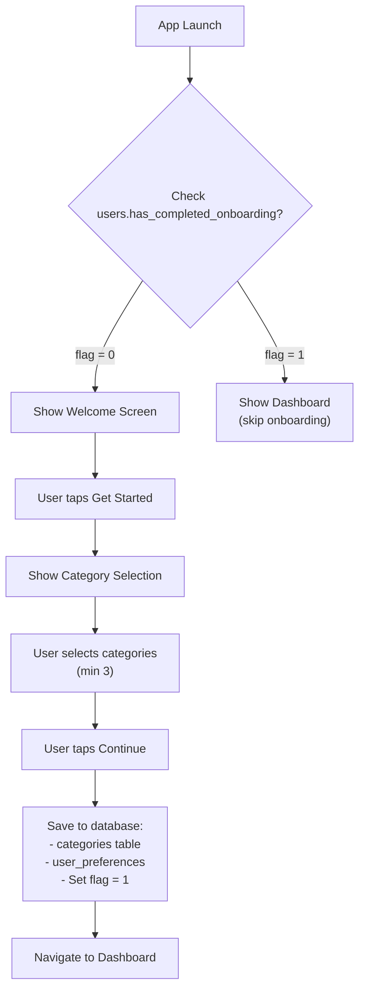

# Feature 01: Onboarding & Category Selection

## Overview
First-time users see a minimal onboarding flow that introduces Mr. Oyen and lets them select their default expense categories. This is a fast, friction-free entry point designed for Gen Z impatience.

## Scope

### Included in MVP
- Welcome screen with Mr. Oyen introduction
- Category multi-select screen (predefined options + custom category option)
- Save selected categories to database
- Mark `has_completed_onboarding = 1` in users table
- Skip onboarding if returning user (check flag on app launch)

### Not Included (v2+)
- Advanced avatar customization (Mr. Oyen skin colors, accessories)
- Onboarding tutorials for other features (widget, chat)
- Budget goal setting during onboarding
- Recurring transaction templates

## User Stories

### US-01.01: Welcome Screen
**As a** new user opening the app for the first time  
**I want to** see an introduction to the app and Mr. Oyen  
**So that** I understand what this app does

**Acceptance Criteria**
- [ ] Welcome screen displays after app cold start
- [ ] Mr. Oyen 3D asset renders with "happy" expression (128px × 128px)
- [ ] Title says "Welcome to Pawcket" (bold, large)
- [ ] Subtitle explains: "Your lazy financial buddy who gets bossy when you overspend"
- [ ] "Get Started" button visible and tappable
- [ ] Tapping button navigates to category selection screen
- [ ] Screen has app background color (neutral-50)

### US-01.02: Category Selection
**As a** new user  
**I want to** select which expense categories are relevant to me  
**So that** expense input suggestions are personalized

**Acceptance Criteria**
- [ ] Screen shows grid/list of predefined categories (Food, Transport, Entertainment, etc.)
- [ ] Each category has:
  - Icon (from Flutter icon set)
  - Name
  - Checkbox (unchecked by default, top 3-4 auto-checked)
- [ ] "Add Custom Category" option at bottom (allows user to input custom name)
- [ ] Custom category can be entered via text input popup
- [ ] "Continue" button saves all selected categories to database
- [ ] At least 3 categories must be selected before "Continue" is enabled
- [ ] Validation: category names max 30 characters, no duplicates
- [ ] On save, user_preferences and default categories created in DB
- [ ] Navigation: after save, dismiss onboarding and show dashboard

### US-01.03: Skip Onboarding (Returning Users)
**As a** returning user  
**I want to** skip the onboarding flow automatically  
**So that** I can immediately access the app

**Acceptance Criteria**
- [ ] On app launch, check `users.has_completed_onboarding` flag
- [ ] If `1`, skip onboarding and go directly to dashboard
- [ ] If `0`, show welcome screen
- [ ] Flag persists across app restarts

## User Flow Diagram



## API Endpoints

### No external API calls
Onboarding is entirely local. All data persisted to SQLite.

## Database Operations

### Insert users record (if first launch)
```sql
INSERT INTO users (device_id, has_completed_onboarding, created_at, updated_at)
VALUES (?, 0, ?, ?)
```

### Insert default categories (after selection)
```sql
INSERT INTO categories (user_id, category_name, category_type, icon_name, color_hex, is_default, created_at, updated_at)
VALUES 
  (?, 'Food', 'food', 'fastfood', '#F97316', 1, ?, ?),
  (?, 'Transport', 'transport', 'directions_car', '#0284C7', 1, ?, ?),
  -- ... more predefined categories
  (?, 'Custom: Hobby', 'custom_hobby', 'palette', '#6B7280', 0, ?, ?);  -- user-custom
```

### Update user onboarding flag
```sql
UPDATE users SET has_completed_onboarding = 1, updated_at = ? WHERE user_id = ?
```

### Insert user preferences
```sql
INSERT INTO user_preferences (user_id, created_at, updated_at)
VALUES (?, ?, ?)
```

## Data Models

### Categories (Predefined)
```dart
enum PredefinedCategory {
  food('Food', 'food', 'fastfood', '#F97316'),
  transport('Transport', 'transport', 'directions_car', '#0284C7'),
  entertainment('Entertainment', 'entertainment', 'theaters', '#A855F7'),
  utilities('Utilities', 'utilities', 'lightbulb', '#EAB308'),
  healthcare('Healthcare', 'healthcare', 'health_and_safety', '#EC4899'),
  shopping('Shopping', 'shopping', 'shopping_bag', '#14B8A6'),
  housing('Housing', 'housing', 'home', '#78716C'),
  other('Other', 'other', 'category', '#6B7280');
  
  final String displayName;
  final String categoryType;
  final String iconName;
  final String colorHex;
  
  const PredefinedCategory(this.displayName, this.categoryType, this.iconName, this.colorHex);
}
```

## Edge Cases & Error Handling

| Edge Case | Behavior | HTTP Status |
|-----------|----------|-------------|
| User force-closes app during onboarding | Has_completed_onboarding remains 0; next launch shows onboarding again | N/A (local only) |
| No categories selected | "Continue" button disabled; helper text: "Select at least 3 categories" | N/A |
| Custom category name duplicates existing | Show validation error: "Category already exists" | N/A |
| Custom category name exceeds 30 chars | Truncate or show error; prevent save | N/A |
| Database insert fails (disk full, corrupted) | Show error: "Failed to save. Try again?" with retry button | N/A |
| Device ID generation fails | Use random UUID; store as-is | N/A |

## Implementation Notes

### Predefined Categories
Hard-code the list of predefined categories in `lib/utils/constants.dart`. Seed them into the database on first user creation. Use Material Icons for all icons (Flutter native support).

### Custom Categories
Allow users to add unlimited custom categories. Store `is_default = 0` for custom ones. No validation beyond length/duplicates.

### Biometric / PIN Setup (Deferred)
Onboarding v1 does NOT include biometric or PIN setup. Users can configure in Settings later.

### Personalization
Auto-select the top 3-4 most common categories (Food, Transport, Entertainment) based on typical Gen Z spending patterns. Users can deselect.

### Device ID
Generate once using `device_info_plus` or UUID package. Store in `users.device_id` for future cloud sync feature.

## Testing Strategy

### Unit Tests
- Category enum parsing
- Device ID generation
- Database insert success/error scenarios

### Widget Tests
- Welcome screen renders correctly
- Category grid displays predefined categories
- Custom category input validation
- "Continue" button enabled/disabled state

### Integration Tests
- Full onboarding flow: launch → welcome → category selection → save → dashboard
- Returning user skips onboarding
- Categories persisted to SQLite and queryable

### Manual Testing
- Test on Android 10, 12, 14 (minimum)
- Verify Mr. Oyen asset renders (no stretching, correct size)
- Test force-close during category selection (verify resume state)

## Definition of Done
- [ ] All user story acceptance criteria pass
- [ ] All database operations tested (inserts verified in SQLite)
- [ ] Onboarding screen layout matches design guide (spacing, colors, typography)
- [ ] Mr. Oyen asset displays correctly (no corruption, correct expression)
- [ ] Custom category input validates (length, duplicates)
- [ ] Edge cases handled gracefully (no crashes)
- [ ] No TypeScript/Dart errors (`flutter analyze` passes)
- [ ] Onboarding can be tested in emulator without internet
- [ ] `docs/04_dev_log.md` updated with implementation decisions
- [ ] Status in `docs/00_master_plan.md` updated to ✅ Done

