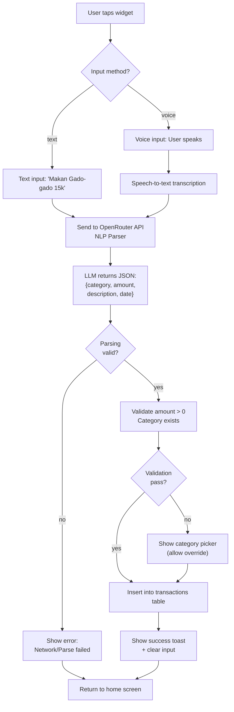

# Feature 02: Home Screen Widget (NLP Text & Voice Input)

## Overview
The home screen widget is Pawcket's killer feature: a transparent, interactive widget on Android's home screen that lets users log expenses via natural language ("Makan Gado-gado 15k") without opening the app. Input is parsed by an LLM (via OpenRouter) into structured transaction data and saved locally.

## Scope

### Included in MVP
- Android 10+ transparent home screen widget
- Text input field in widget (NLP parser)
- Voice input button (speech-to-text, then NLP parse)
- Real-time LLM parsing via OpenRouter API
- Save parsed transaction to local SQLite
- Basic validation (amount > 0, category exists)
- Success/error feedback in widget UI

### Not Included (v2+)
- iOS widget (requires alternative input method due to iOS restrictions)
- Voice input offline fallback (requires on-device model)
- Transaction confirmation modal (MVP saves directly)
- Receipt image upload via widget
- Multi-language support (Indonesian only for v1)

## User Stories

### US-02.01: Add Transaction via Text Input
**As a** Gen Z user on their home screen  
**I want to** tap the Pawcket widget and type "Makan Gado-gado 15k"  
**So that** the expense is logged instantly without opening the app

**Acceptance Criteria**
- [ ] Widget displays text input field + voice button + "Add" button
- [ ] Widget is transparent (blends with home screen wallpaper)
- [ ] Widget size: 4 × 2 grid (approx 300px wide × 120px tall on standard phone)
- [ ] Text input accepts natural language in Indonesian or English
- [ ] After user types and taps "Add", text is sent to OpenRouter LLM parser
- [ ] LLM response is parsed into JSON: `{category, amount, description, date, day}`
- [ ] If parsing succeeds, transaction is saved to local SQLite
- [ ] If parsing fails, widget shows error: "I didn't understand. Try again?"
- [ ] On success, widget shows confirmation toast: "✓ Added 15,000 IDR" (2 seconds)
- [ ] Input field clears after successful save
- [ ] All operations complete within 3 seconds (UX expectation)

### US-02.02: Add Transaction via Voice Input
**As a** a user with hands full (carrying groceries)  
**I want to** tap the voice button and say "Makan gado-gado lima belas ribu"  
**So that** I can log the expense without typing

**Acceptance Criteria**
- [ ] Microphone button visible in widget (🎤 icon)
- [ ] Tapping starts speech-to-text recording
- [ ] Widget shows recording indicator (animated waveform or pulsing icon)
- [ ] Speech is transcribed to text (using `speech_to_text` package)
- [ ] After 3 seconds of silence, recording stops automatically
- [ ] Transcribed text is passed to NLP parser (same as text input)
- [ ] On success, transaction saved and widget shows confirmation
- [ ] If speech-to-text fails (no microphone permission), show: "Microphone not enabled"
- [ ] If speech is silent/unclear, show: "Didn't catch that. Try again?"

### US-02.03: NLP Parsing Error Handling
**As a** a user entering ambiguous text  
**I want to** get a clear error message if the LLM can't parse my input  
**So that** I can rephrase and try again

**Acceptance Criteria**
- [ ] If OpenRouter API returns error (rate limit, timeout), show: "Network trouble. Retry?"
- [ ] If LLM successfully parses but output is invalid JSON, show: "Something went wrong. Try again?"
- [ ] If parsed amount is 0 or negative, reject: "Amount must be positive"
- [ ] If parsed category doesn't exist in user's categories, show category picker (allow override)
- [ ] All error messages appear in widget inline (max 50 chars)
- [ ] Retry button visible on error (allows re-submitting same text)
- [ ] No error logs sent to external servers (privacy-first)

### US-02.04: Transaction Saved to Database
**As a** the database layer  
**I want to** receive parsed transaction data and persist it  
**So that** it's queryable in the dashboard

**Acceptance Criteria**
- [ ] Parsed transaction object includes: category_id, amount_idr, description, transaction_date, transaction_type (always 'expense')
- [ ] Transaction inserted into `transactions` table with:
  - category_id (from user's selected categories)
  - amount_idr (parsed and validated)
  - description (raw user input)
  - transaction_date (now, in UTC ms)
  - is_synced_to_cloud = 0 (always local-first)
  - nlp_confidence (1.0 for initial parse, lower if user corrects)
- [ ] Insert succeeds even if offline (no API call to persist locally)
- [ ] Inserted transaction immediately queryable for dashboard

## User Flow Diagram



## API Endpoints

### OpenRouter API (LLM Parsing)

**Endpoint:** `POST https://openrouter.ai/api/v1/chat/completions`

**Request:**
```json
{
  "model": "meta-llama/llama-2-70b",
  "messages": [
    {
      "role": "system",
      "content": "You are a transaction parser. User input is in Indonesian or English. Parse it strictly into JSON format:\n{\n  \"category\": \"one of: food, transport, entertainment, utilities, healthcare, shopping, housing, other\",\n  \"amount\": <positive integer in IDR>,\n  \"vendor\": \"<vendor name or empty string>\",\n  \"description\": \"<raw user input>\",\n  \"date\": \"YYYY-MM-DD\",\n  \"day\": \"<Monday, Tuesday, etc>\"\n}\nIf parsing is impossible, return {\"error\": \"reason\"}. Never return markdown or explanations."
    },
    {
      "role": "user",
      "content": "Makan Gado-gado 15k"
    }
  ],
  "temperature": 0.3,
  "max_tokens": 200
}
```

**Response (Success):**
```json
{
  "choices": [
    {
      "message": {
        "content": "{\"category\": \"food\", \"amount\": 15000, \"vendor\": \"gado-gado stand\", \"description\": \"Makan Gado-gado 15k\", \"date\": \"2025-01-15\", \"day\": \"Tuesday\"}"
      }
    }
  ],
  "usage": {
    "prompt_tokens": 120,
    "completion_tokens": 60
  }
}
```

**Response (Error):**
```json
{
  "error": {
    "message": "Rate limit exceeded",
    "type": "rate_limit_error"
  }
}
```

### Rate Limiting
- OpenRouter free tier: ~5 requests/min
- Implement exponential backoff: retry after 2s, 5s, 10s
- Cache common transactions (e.g., "Makan" = food) to reduce API calls

## Database Operations

### Save parsed transaction
```sql
INSERT INTO transactions (
  user_id, category_id, transaction_type, amount_idr, 
  description, vendor_name, transaction_date, created_at, updated_at, is_synced_to_cloud, nlp_confidence
)
VALUES (?, ?, 'expense', ?, ?, ?, ?, ?, ?, 0, 1.0);
```

### Verify category exists
```sql
SELECT category_id FROM categories WHERE user_id = ? AND category_name = ? AND deleted_at IS NULL;
```

## Data Models

### Parsed Transaction (from LLM)
```dart
class ParsedTransaction {
  final String category;              // e.g., 'food'
  final int amount;                   // e.g., 15000 IDR
  final String? vendor;               // e.g., 'gado-gado stand' (nullable)
  final String description;           // Raw user input
  final DateTime transactionDate;     // When expense occurred
  final String? error;                // If parsing failed
  
  const ParsedTransaction({
    required this.category,
    required this.amount,
    this.vendor,
    required this.description,
    required this.transactionDate,
    this.error,
  });
  
  factory ParsedTransaction.fromJson(Map<String, dynamic> json) {
    // Deserialize from LLM response
  }
}
```

### Widget State
```dart
class WidgetInputState {
  final String inputText;
  final bool isLoading;
  final String? errorMessage;
  final bool isRecording;
  
  const WidgetInputState({
    this.inputText = '',
    this.isLoading = false,
    this.errorMessage,
    this.isRecording = false,
  });
}
```

## Edge Cases & Error Handling

| Edge Case | Behavior |
|-----------|----------|
| User enters "100" (no category hint) | LLM defaults to "other" category; user can override in fallback picker |
| User enters "123456789" (very large amount) | Accept if valid; transaction saved. No hard cap. |
| User enters empty text | "Add" button disabled; helper text: "Say what you bought" |
| LLM returns unparseable JSON | Catch JSON decode error; show: "Parsing failed. Try again?" |
| Speech-to-text returns empty | Show: "I didn't hear anything. Try again?" |
| OpenRouter API timeout (>3s) | Show: "Taking too long. Tap to retry." |
| API rate limit exceeded | Implement retry with exponential backoff; show "Quick, I'm busy!" (flavor text) |
| User has no categories (onboarding skipped) | Fall back to hardcoded default categories; seed if needed |
| Network unavailable (offline) | Queue transaction locally; sync on reconnect (v2 feature) |
| Invalid category returned by LLM | Show picker: "Which category?" (single-select, required) |
| Widget size too small for text input | Adaptive layout: hide voice button if space < 250px wide |

## Implementation Notes

### Widget Architecture
- **Native layer:** Android Kotlin (AppWidget Provider, RemoteViews)
- **Flutter layer:** Platform channels communicate with Kotlin layer
- **Lifecycle:** Widget updates happen in background service (no full app launch)
- **Transparency:** Set widget background to transparent (#00000000) in layout XML

### NLP Parser Service
- Create `lib/services/api/nlp_parser.dart` with `parseExpenseFromText()` function
- Always use OpenRouter (cheaper than direct model APIs)
- Hardcode system prompt (don't let LLM be creative)
- Validate output before saving to database
- Log API calls locally (device only; no external telemetry)

### Voice Input
- Use `speech_to_text` package (Flutter)
- Initialize with Indonesian locale: `localeId: 'id_ID'`
- Handle permission denial gracefully (show permission dialog)
- Offline fallback: disable voice button if no internet

### Widget Lifecycle
1. User taps widget → Opens widget input form (lightweight, no heavy UI)
2. User types/speaks → Input captured
3. User taps "Add" → API call + parse + DB insert (async)
4. Success → Show toast, clear input, stay on widget
5. Error → Show error, keep input, user can retry

### Performance Optimization
- Cache LLM responses for identical inputs (e.g., "Bensin 50k" seen 3x today)
- Use background isolate for API calls (don't block widget thread)
- Preload categories on widget first display (avoid delay)
- Debounce rapid submissions (max 1 transaction per 2 seconds)

## Testing Strategy

### Unit Tests
- NLP response parsing (JSON decode, validation)
- Amount validation (positive, integer only)
- Category lookup (existing vs. missing)
- Date formatting (today's date in correct format)

### Widget Tests
- Widget renders text input + voice button + add button
- Text input accepts alphanumeric + special characters (space, dash, comma)
- "Add" button disabled when input empty
- Error message displays correctly (toast or inline)

### Integration Tests
- Full flow: type "Makan 15k" → API call → parse → save → query database
- Voice input flow: tap mic → speak → transcribe → parse → save
- Error handling: API timeout → retry mechanism
- Offline behavior: queue transaction locally

### Android Tests
- Widget layout renders correctly on 4.5", 5.5", 6.7" screens
- Transparency setting works (no opaque background)
- Platform channel communication (Dart ↔ Kotlin)
- Background service lifecycle (widget survives app close)

### Manual Testing
- Test on Android 10, 12, 14
- Add widget to home screen, verify size
- Test voice input with and without microphone permission
- Test network failures (unplug wifi, use cellular)
- Verify transaction appears in dashboard immediately after save

## Definition of Done
- [ ] All user story acceptance criteria pass
- [ ] NLP parser successfully parses 15+ example inputs (unit test coverage)
- [ ] Widget renders correctly on multiple screen sizes (320px, 480px, 720px)
- [ ] Voice input works with microphone enabled/disabled
- [ ] Parsed transactions saved to SQLite and queryable
- [ ] Error messages are user-friendly (no stack traces)
- [ ] API calls respect rate limiting (no spam to OpenRouter)
- [ ] Widget survives app close/restart (Android lifecycle)
- [ ] No Dart compile errors (`flutter analyze` passes)
- [ ] Transactions visible in dashboard within 1 second of save
- [ ] `docs/04_dev_log.md` updated with decisions (widget library choice, API provider, etc.)
- [ ] Status in `docs/00_master_plan.md` updated to ✅ Done

