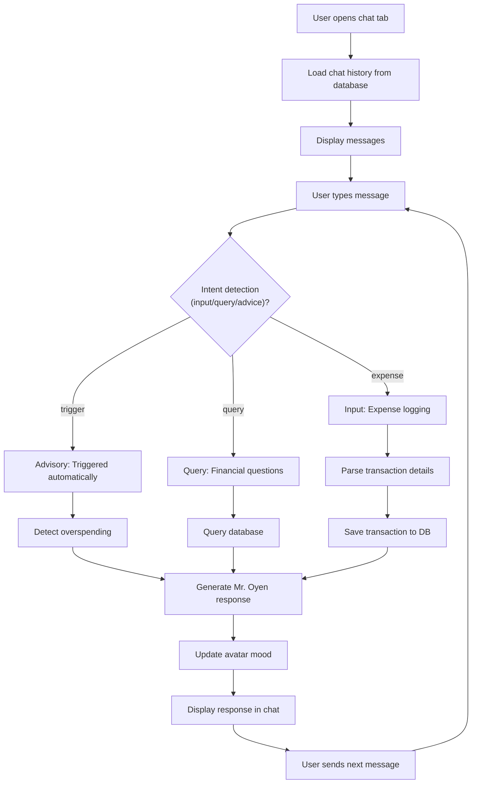

# Feature 03: AI Chat Assistant with Mr. Oyen

## Overview
Mr. Oyen is Pawcket's conversational financial assistant. Users chat with him via the middle tab of the bottom navigation. He helps with expense input, answers questions about spending ("How much did I spend on food?"), and gives financial advisory with sass. Mr. Oyen's personality shifts based on spending behavior: lazy and supportive when budgets are healthy, angry and dramatic when users overspend.

## Scope

### Included in MVP
- Chat interface with message bubbles (user left, Mr. Oyen right)
- Mr. Oyen avatar with mood-based expressions (happy, neutral, shocked, angry)
- Expense input via chat ("Log a 20k coffee")
- Financial queries ("How much did I spend on food this month?")
- Advisory mode ("Am I overspending?")
- Chat history persisted locally (current session + past sessions)
- LLM-powered responses via OpenRouter

### Not Included (v2+)
- Voice chat input/output (text-based only for MVP)
- Multi-language chat (Indonesian only)
- Advanced analytics insights (correlation analysis, forecasting)
- Chat memory across sessions (each session independent)
- Mr. Oyen avatar voice lines / audio responses

## User Stories

### US-03.01: Chat with Mr. Oyen
**As a** a user  
**I want to** open the chat tab and send messages to Mr. Oyen  
**So that** I can input expenses and ask about my spending

**Acceptance Criteria**
- [ ] Chat tab (middle icon in bottom nav) opens chat screen
- [ ] Screen shows chat history (current session messages)
- [ ] Message input field at bottom with "Send" button (or swipe-to-send)
- [ ] User message appears on right side in blue bubble
- [ ] Mr. Oyen message appears on left side with avatar and cyan bubble
- [ ] Mr. Oyen's avatar changes expression based on message context:
  - Happy: User asking about savings, staying on budget
  - Neutral: General queries, expense input
  - Shocked: User mentions large overspending
  - Angry: Multiple overspending alerts, dramatic scolding
- [ ] Messages load instantly (local) or after <3s (if API call needed)
- [ ] Chat history persists across app sessions
- [ ] User can start a new chat session (clear history button in settings)

### US-03.02: Input Expenses via Chat
**As a** a user  
**I want to** tell Mr. Oyen "I spent 50k on groceries" in chat  
**So that** the expense is logged via conversation (not widget)

**Acceptance Criteria**
- [ ] User message like "I spent 50k on groceries" is parsed for intent (input vs. query)
- [ ] If intent = input, Mr. Oyen acknowledges: "Gotcha. 50,000 IDR on groceries. Added! 👍"
- [ ] Transaction saved to database with:
  - category = parsed category (groceries → shopping/utilities)
  - amount = parsed amount (50k → 50000)
  - description = user's raw input
  - date = today
  - is_synced_to_cloud = 0
- [ ] If parsing fails, Mr. Oyen asks for clarification: "Didn't catch that. How much did you spend and on what?"
- [ ] User can correct input: "Actually 60k" → Re-parse and update transaction (or create new one)
- [ ] Confirmation message includes emoji + friendly tone

### US-03.03: Query Financial Status
**As a** a user  
**I want to** ask Mr. Oyen "How much did I spend on food this month?"  
**So that** I get instant answers without opening dashboard

**Acceptance Criteria**
- [ ] User message detected as query (keywords: "how much", "spent", "total", "balance", etc.)
- [ ] System queries local database:
  - `SELECT SUM(amount_idr) FROM transactions WHERE category='food' AND MONTH(transaction_date)=THIS_MONTH`
- [ ] Mr. Oyen responds with the result: "You spent 450,000 IDR on food so far this month. That's about 15,000/day."
- [ ] If no transactions in category, respond: "No food expenses yet this month. Looking healthy! 😺"
- [ ] Response includes helpful context: daily average, percentage of budget (if budget set), trend

### US-03.04: Advisory Mode (Overspending Detection)
**As a** a user who's overspending  
**I want to** Mr. Oyen to notice and alert me  
**So that** I understand the severity of my spending

**Acceptance Criteria**
- [ ] System detects overspending triggers:
  - Total monthly expense > 2M IDR (configurable threshold)
  - Spending spike (today's amount > 5x daily average)
  - Category overspend (e.g., food > 20% of total)
- [ ] When overspending detected, Mr. Oyen shifts mood to "shocked" or "angry"
- [ ] Mr. Oyen sends unsolicited message (or responds with sass):
  - Moderate overspend: "Whoa, 300k on food already? Chill 😾"
  - Severe overspend: "BOSS ALERT! 🤬 You just dropped 500k like it's nothing. We need to talk."
  - With emoji variations based on severity
- [ ] Advisory message is conversational, not preachy
- [ ] User can ask "Why are you mad?" → Mr. Oyen explains the spending spike

### US-03.05: Chat Session Persistence
**As a** a returning user  
**I want to** see my chat history when I reopen the app  
**So that** I don't lose context

**Acceptance Criteria**
- [ ] All chat messages saved to `chat_messages` table
- [ ] On app reopen, load messages from current session (or most recent session)
- [ ] User can start a new session via "New Chat" button (optional v1)
- [ ] Old sessions accessible via "History" (optional v1; can defer)
- [ ] Session persists across app restarts, device restart, etc.
- [ ] Max message count per session: 100 (oldest auto-archived)

## User Flow Diagram



## API Endpoints

### OpenRouter API (Chat Generation)

**Endpoint:** `POST https://openrouter.ai/api/v1/chat/completions`

**System Prompt (hardcoded):**
```
You are Mr. Oyen, an expressive orange cat financial assistant. You're naturally lazy and acerbic, but become dramatically upset when users overspend. Personality traits:
- Lazy: You act indifferent initially, but jump to action when needed
- Expressive: Use emojis liberally (cat faces: 😺 😸 😻 😾 😿)
- Sassy: When detecting overspending, you become theatrical and scolding
- Helpful: Despite the sass, you genuinely help users understand their finances
- Indonesian-friendly: Accept both Indonesian and English, respond naturally

When parsing user messages:
1. Detect intent: (input) expense logging, (query) financial questions, (advice) unsolicited commentary
2. For input: extract category, amount, description. Confirm with amount formatted as "X,XXX IDR"
3. For query: understand the question, respond with numbers from conversation context
4. For advice: comment on spending patterns based on what you know from the chat

Always respond in natural, conversational Indonesian or English (match user's language). Keep responses brief (<100 words). Never break character. Always include an emoji or two.

User's current monthly spending context: [inserted dynamically]
```

**Request (Expense Input Example):**
```json
{
  "model": "meta-llama/llama-2-70b",
  "messages": [
    {
      "role": "system",
      "content": "[System prompt above, with dynamic context]"
    },
    {
      "role": "user",
      "content": "I just spent 50k on groceries"
    }
  ],
  "temperature": 0.8,
  "max_tokens": 150
}
```

**Response:**
```json
{
  "choices": [
    {
      "message": {
        "content": "Noted. 50,000 IDR on groceries. I'll add that to your list. 😸 Keep the receipts!"
      }
    }
  ]
}
```

## Database Operations

### Save chat message
```sql
INSERT INTO chat_messages (session_id, sender_role, content, transaction_id, created_at)
VALUES (?, 'user', ?, NULL, ?);

INSERT INTO chat_messages (session_id, sender_role, content, transaction_id, created_at)
VALUES (?, 'assistant', ?, NULL, ?);
```

### Load chat history
```sql
SELECT * FROM chat_messages 
WHERE session_id = ? 
ORDER BY created_at ASC 
LIMIT 100;
```

### Query spending (for advisory context)
```sql
SELECT 
  SUM(CASE WHEN transaction_type='expense' THEN amount_idr ELSE 0 END) as total_expense,
  SUM(CASE WHEN transaction_type='income' THEN amount_idr ELSE 0 END) as total_income,
  COUNT(*) as transaction_count
FROM transactions
WHERE user_id = ? 
  AND strftime('%Y-%m', datetime(transaction_date/1000, 'unixepoch')) = strftime('%Y-%m', 'now')
  AND deleted_at IS NULL;
```

## Data Models

### Chat Message
```dart
class ChatMessage {
  final int messageId;
  final int sessionId;
  final String senderRole;  // 'user' or 'assistant'
  final String content;
  final int? transactionId; // Nullable: link to transaction if triggered one
  final DateTime createdAt;
  
  const ChatMessage({
    required this.messageId,
    required this.sessionId,
    required this.senderRole,
    required this.content,
    this.transactionId,
    required this.createdAt,
  });
}
```

### Chat Session
```dart
class ChatSession {
  final int sessionId;
  final int userId;
  final String? sessionTitle;
  final DateTime createdAt;
  final DateTime updatedAt;
  final String? lastMood;  // 'happy', 'neutral', 'shocked', 'angry'
  final List<ChatMessage> messages;
  
  const ChatSession({
    required this.sessionId,
    required this.userId,
    this.sessionTitle,
    required this.createdAt,
    required this.updatedAt,
    this.lastMood = 'neutral',
    this.messages = const [],
  });
}
```

### Intent Detection (Internal)
```dart
enum MessageIntent {
  expenseInput,    // User logging an expense
  financialQuery,  // User asking about spending
  unsolicited,     // Mr. Oyen's advisory (triggered automatically)
  casual           // General conversation
}
```

## Edge Cases & Error Handling

| Edge Case | Behavior |
|-----------|----------|
| User enters text with no amounts ("I spent a lot") | Mr. Oyen asks: "How much did you spend? I need a number!" |
| Chat message is ambiguous ("20k coffee or transport?") | Mr. Oyen asks: "Is that on food, transport, or something else?" |
| LLM response is generic or unhelpful | Retry with improved system prompt; log to dev_log |
| User types rapidly (5 messages in 1 second) | Queue messages; process serially (prevent API spam) |
| API timeout (>5 seconds) | Show: "Mr. Oyen is thinking..." with loading spinner |
| API rate limit exceeded | Show: "I'm tired. Give me a moment..." (retry in 5s) |
| User has zero transactions this month | Context: "No spending data yet. Go forth and buy!" |
| Category ambiguity ("50k" with no vendor) | Default to "other"; suggest category picker |
| Chat session corrupted (database error) | Show error, allow starting new session |
| Empty user message | "Add" button disabled; show: "Tell me something!" |

## Implementation Notes

### Intent Detection
Implement simple keyword-based detection before sending to LLM:
- Input: keywords = ["spent", "bought", "paid", "given", "transferred"]
- Query: keywords = ["how much", "total", "spent", "balance", "budget"]
- Advice: triggered by spending thresholds, not user message

### Mr. Oyen Mood System
- Track mood in `chat_sessions.last_mood`
- Update mood based on overspending detection
- Mood affects avatar expression (use different asset variants)
- Mood persists across messages in same session

### Context Management
- Before each API call, query last 5 transactions + monthly summary
- Insert context into system prompt (current spending, recent transactions)
- This allows Mr. Oyen to give contextual responses without full memory

### Rate Limiting
- Max 5 API calls/minute per user (OpenRouter free tier)
- Implement queue + backoff for rapid messages
- Cache common responses (e.g., "How much on food?" asked 3x → use same response)

### Performance
- Load chat history asynchronously (lazy load first 20, then paginate)
- Debounce message sends (max 1 per 500ms to prevent double-tap)
- Show loading indicator while API call is in progress

## Testing Strategy

### Unit Tests
- Intent detection (input vs. query vs. advisory)
- Amount extraction from user message ("50k" → 50000)
- Category matching (groceries → shopping)
- Mood state transitions (happy → angry when overspend)

### Widget Tests
- Chat bubble renders correctly (user left, assistant right)
- Mr. Oyen avatar displays correct expression
- Message input field accepts text
- Send button disabled when empty
- Chat history displays in chronological order

### Integration Tests
- Full flow: user types "50k coffee" → parsed → saved → Mr. Oyen responds
- Query flow: user asks "How much on food?" → database query → response
- Advisory flow: user triggers overspend → Mr. Oyen detects → sends sassy message
- Session persistence: messages saved to DB and reloadable

### Manual Testing
- Test with Indonesian and English messages
- Verify Mr. Oyen's mood changes visually (avatar expression)
- Test with slow network (API timeout → show loading state)
- Verify transaction created in database after chat input

## Definition of Done
- [ ] All user story acceptance criteria pass
- [ ] Intent detection works for 90%+ of test messages (unit tests)
- [ ] Chat messages saved to database and persistent across restarts
- [ ] Mr. Oyen avatar renders with mood expressions (happy, neutral, shocked, angry)
- [ ] API calls respect rate limiting (no spam to OpenRouter)
- [ ] Error messages are user-friendly (no stack traces)
- [ ] Chat history displays chronologically, newest at bottom
- [ ] Transaction created when user inputs expense via chat
- [ ] Advisory detection works (monthly spend > threshold → Mr. Oyen alerts)
- [ ] No Dart compile errors (`flutter analyze` passes)
- [ ] `docs/04_dev_log.md` updated with prompt engineering decisions
- [ ] Status in `docs/00_master_plan.md` updated to ✅ Done

