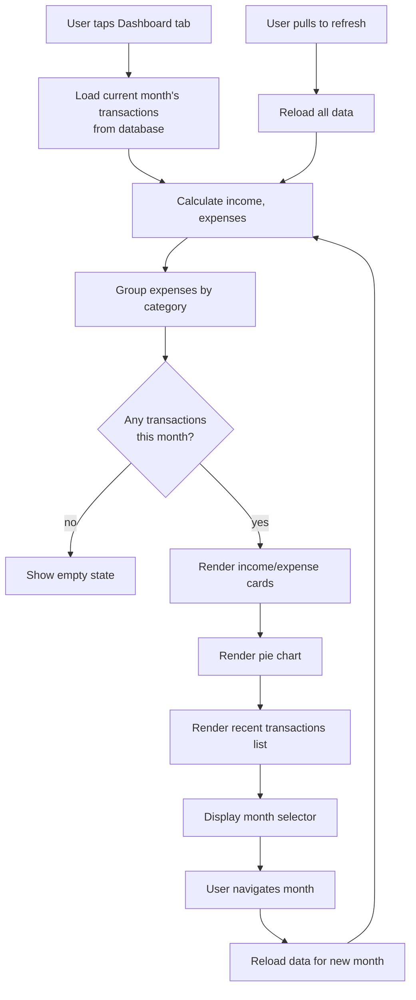

# Feature 04: Dashboard (Analytics & Summary)

## Overview
The dashboard is Pawcket's main view (left tab in bottom navigation). It shows a clean, simple summary of the current month's finances: income vs. expenses, expense breakdown by category (pie chart), and recent transactions. Design is minimalist and Gen Z–friendly.

## Scope

### Included in MVP
- Monthly income vs. expenses summary (cards)
- Pie chart: expense breakdown by category (color-coded)
- Recent transactions list (last 10)
- Month selector (view previous months)
- Refresh button (manual reload from database)
- Empty state (no transactions this month)

### Not Included (v2+)
- Trend analysis (month-over-month comparison)
- Budget progress bars (requires budget feature)
- Spending forecasts
- Advanced filters (by date range, vendor)
- Export to CSV/PDF

## User Stories

### US-04.01: View Monthly Summary Cards
**As a** a user  
**I want to** see my total income and expenses at a glance  
**So that** I understand my cashflow immediately

**Acceptance Criteria**
- [ ] Dashboard displays two cards at the top:
  - Card 1: Income (green accent) — shows total income this month in bold, large font
  - Card 2: Expenses (red accent) — shows total expenses this month
- [ ] Numbers formatted as: "1,500,000 IDR" (comma-separated, right-aligned)
- [ ] If no transactions, show "0 IDR"
- [ ] Cards are full-width with 16px padding
- [ ] Cards have subtle shadow and border (design guide colors)
- [ ] Percentage change indicator optional (e.g., "+5% vs last month") — deferred to v2

### US-04.02: View Expense Breakdown (Pie Chart)
**As a** a user  
**I want to** see what percentage of my spending goes to each category  
**So that** I can spot which categories are eating up my budget

**Acceptance Criteria**
- [ ] Pie chart displays current month's expense breakdown
- [ ] Each slice colored according to category (design guide colors)
- [ ] Legend below chart lists all categories with amount and percentage
- [ ] If category has 0 spending, it's excluded from chart (no gray slices)
- [ ] Chart is interactive: tap a slice to highlight it (optional v1)
- [ ] Total in center of pie: "Total: 1,500,000 IDR"
- [ ] If no expenses, show empty state: "No expenses yet! 😸"
- [ ] Chart animates on load (fade-in, 300ms)

### US-04.03: View Recent Transactions
**As a** a user  
**I want to** see my 10 most recent expenses  
**So that** I can verify they were logged correctly

**Acceptance Criteria**
- [ ] List shows transactions sorted by date (newest first)
- [ ] Each transaction tile displays:
  - Category icon (left, 48px)
  - Description (main text)
  - Date (small text, e.g., "Jan 15, Tuesday")
  - Amount (right, bold, red text for expenses)
  - Sync status indicator (dot: green=synced, gray=local only)
- [ ] Tiles are tappable (optional: open transaction detail/edit modal)
- [ ] Pull-to-refresh reloads data from database
- [ ] "Load more" button at bottom (load next 10 transactions)
- [ ] Swipe left on tile to delete (with confirmation) — optional v1

### US-04.04: Navigate Between Months
**As a** a user  
**I want to** switch between months to see historical spending  
**So that** I can analyze trends (even though detailed trends are v2)

**Acceptance Criteria**
- [ ] Month selector at the top of dashboard (e.g., "January 2025")
- [ ] Left/right arrow buttons to navigate previous/next months
- [ ] Tapping month selector opens calendar picker (optional; can defer)
- [ ] Dashboard updates when month changes:
  - Income/expense cards reflect selected month
  - Pie chart recalculates for that month
  - Recent transactions filtered to that month
- [ ] Cannot navigate to future months (button disabled)
- [ ] Current month is highlighted / pre-selected

### US-04.05: Empty State
**As a** a new user or someone with no expenses this month  
**I want to** see a friendly empty state  
**So that** I know what to do next

**Acceptance Criteria**
- [ ] If no transactions in selected month, show:
  - Empty state illustration (optional) or Mr. Oyen asset (happy expression)
  - Message: "No expenses yet this month. Add your first one! 👇"
  - Quick action button: "Log Expense" (links to chat or widget input)
- [ ] Empty state is centered, large text, friendly tone
- [ ] Cards and chart hidden if no data (or show 0s — decide in dev)

## User Flow Diagram



## Database Queries

### Monthly Summary
```sql
SELECT 
  COALESCE(SUM(CASE WHEN transaction_type='income' THEN amount_idr ELSE 0 END), 0) as total_income,
  COALESCE(SUM(CASE WHEN transaction_type='expense' THEN amount_idr ELSE 0 END), 0) as total_expense
FROM transactions
WHERE user_id = ? 
  AND deleted_at IS NULL
  AND strftime('%Y-%m', datetime(transaction_date/1000, 'unixepoch')) = ?;  -- e.g., '2025-01'
```

### Expense Breakdown by Category
```sql
SELECT 
  c.category_id,
  c.category_name,
  c.color_hex,
  c.icon_name,
  SUM(t.amount_idr) as total_amount,
  ROUND(100.0 * SUM(t.amount_idr) / (SELECT SUM(amount_idr) FROM transactions WHERE user_id=? AND transaction_type='expense' AND deleted_at IS NULL AND strftime('%Y-%m', datetime(transaction_date/1000, 'unixepoch'))=?), 1) as percentage
FROM transactions t
JOIN categories c ON t.category_id = c.category_id
WHERE t.user_id = ? 
  AND t.transaction_type = 'expense'
  AND t.deleted_at IS NULL
  AND strftime('%Y-%m', datetime(t.transaction_date/1000, 'unixepoch')) = ?
GROUP BY c.category_id, c.category_name, c.color_hex, c.icon_name
ORDER BY total_amount DESC;
```

### Recent Transactions
```sql
SELECT 
  t.transaction_id,
  t.category_id,
  c.category_name,
  c.icon_name,
  t.description,
  t.amount_idr,
  t.transaction_date,
  t.is_synced_to_cloud
FROM transactions t
JOIN categories c ON t.category_id = c.category_id
WHERE t.user_id = ? 
  AND t.deleted_at IS NULL
  AND strftime('%Y-%m', datetime(t.transaction_date/1000, 'unixepoch')) = ?
ORDER BY t.transaction_date DESC
LIMIT 10;
```

## Data Models

### Dashboard State (Riverpod Provider)
```dart
class DashboardData {
  final int totalIncome;        // IDR
  final int totalExpense;       // IDR
  final int net;                // income - expense
  final List<CategoryBreakdown> categoryBreakdown;
  final List<TransactionSummary> recentTransactions;
  final DateTime selectedMonth;
  final bool isLoading;
  final String? errorMessage;
  
  const DashboardData({
    required this.totalIncome,
    required this.totalExpense,
    required this.net,
    required this.categoryBreakdown,
    required this.recentTransactions,
    required this.selectedMonth,
    this.isLoading = false,
    this.errorMessage,
  });
  
  int get totalTransactions => recentTransactions.length;
}

class CategoryBreakdown {
  final int categoryId;
  final String categoryName;
  final String colorHex;
  final String iconName;
  final int totalAmount;
  final double percentage;
  
  const CategoryBreakdown({
    required this.categoryId,
    required this.categoryName,
    required this.colorHex,
    required this.iconName,
    required this.totalAmount,
    required this.percentage,
  });
}

class TransactionSummary {
  final int transactionId;
  final String categoryName;
  final String description;
  final int amountIdr;
  final DateTime transactionDate;
  final bool isSyncedToCloud;
  
  const TransactionSummary({
    required this.transactionId,
    required this.categoryName,
    required this.description,
    required this.amountIdr,
    required this.transactionDate,
    required this.isSyncedToCloud,
  });
}
```

## Edge Cases & Error Handling

| Edge Case | Behavior |
|-----------|----------|
| No transactions in month | Show empty state with friendly message |
| All transactions deleted (soft delete) | Empty state: "No expenses this month" |
| Category deleted but transactions exist | Show category name from transaction record (not linked to deleted category) |
| Single transaction (100% of spending) | Pie chart shows full circle with 100% label |
| Database query times out | Show error: "Loading took too long. Retry?" with refresh button |
| Very large numbers (1B+ IDR) | Format as "1,000,000,000 IDR" (support 10+ digits) |
| Navigating to future month | Button disabled; grayed out or removed |
| Transaction sync status unknown | Show gray dot (default "not synced") |
| Screen rotated during load | Preserve state, re-render (handle orientation change) |

## Implementation Notes

### Chart Library
Use `fl_chart` Flutter package for pie chart. Configuration:
- Animate on load (300ms)
- Show legend below chart
- Tap-to-highlight optional (can skip for MVP)
- Center text: total amount

### Month Navigation
Store selected month as `DateTime` in provider state. When month changes:
1. Update provider state
2. Trigger database queries (debounce if rapid clicks)
3. Re-render cards, chart, transaction list

### Performance Optimization
- Lazy-load recent transactions (fetch 10 at a time)
- Memoize chart calculations (don't recalculate if data unchanged)
- Debounce month navigation (max 1 query per 500ms)
- Cache monthly summaries in provider (clear on new transaction)

### Real-time Updates
When user adds a transaction (via widget or chat), the dashboard should update automatically:
- Listen to transaction insert events (use Riverpod invalidation or stream)
- Recalculate cards + chart
- Add new transaction to recent list (prepend)

### Responsive Design
- On mobile (< 600px): full-width cards, pie chart above list
- On larger phones (> 600px): cards side-by-side, pie chart above

### Offline Behavior
Dashboard works fully offline:
- Queries local SQLite database
- No API calls needed
- Sync status indicator shows if transactions are backed up

## Testing Strategy

### Unit Tests
- Percentage calculation for pie chart (verify 100% total)
- Amount formatting ("1500000" → "1,500,000")
- Month range logic (cannot navigate to future)
- Empty state conditions (0 transactions, all deleted)

### Widget Tests
- Dashboard screen renders income/expense cards
- Pie chart displays with legend
- Recent transactions list shows correct items
- Month selector buttons enabled/disabled appropriately
- Empty state displays when no data

### Integration Tests
- Full flow: add transaction via widget → see it on dashboard immediately
- Month navigation: switch months → verify data updates
- Pull-to-refresh: data reloads from database
- Transaction deletion: deleted transactions disappear from list

### Manual Testing
- Test with 0 transactions (empty state)
- Test with 1 transaction (100% pie slice)
- Test with 100+ transactions (pagination/load more)
- Test month navigation (current, previous, cannot go to future)
- Test orientation change (portrait ↔ landscape)
- Verify numbers format correctly ("1,500,000 IDR")

## Definition of Done
- [ ] All user story acceptance criteria pass
- [ ] Income/expense cards render with correct values
- [ ] Pie chart displays correctly, percentages sum to 100%
- [ ] Recent transactions list shows 10 items, sorted by date (newest first)
- [ ] Month selector works (navigate prev/next, future disabled)
- [ ] Empty state displays for months with no transactions
- [ ] Pull-to-refresh reloads data and updates UI
- [ ] Numbers formatted with thousands separator (e.g., "1,500,000")
- [ ] Colors match design guide (category colors in pie chart)
- [ ] No database errors or crashes with large datasets (100+ transactions)
- [ ] No Dart compile errors (`flutter analyze` passes)
- [ ] Dashboard updates in real-time when transaction is added
- [ ] `docs/04_dev_log.md` updated with chart library choice, etc.
- [ ] Status in `docs/00_master_plan.md` updated to ✅ Done

