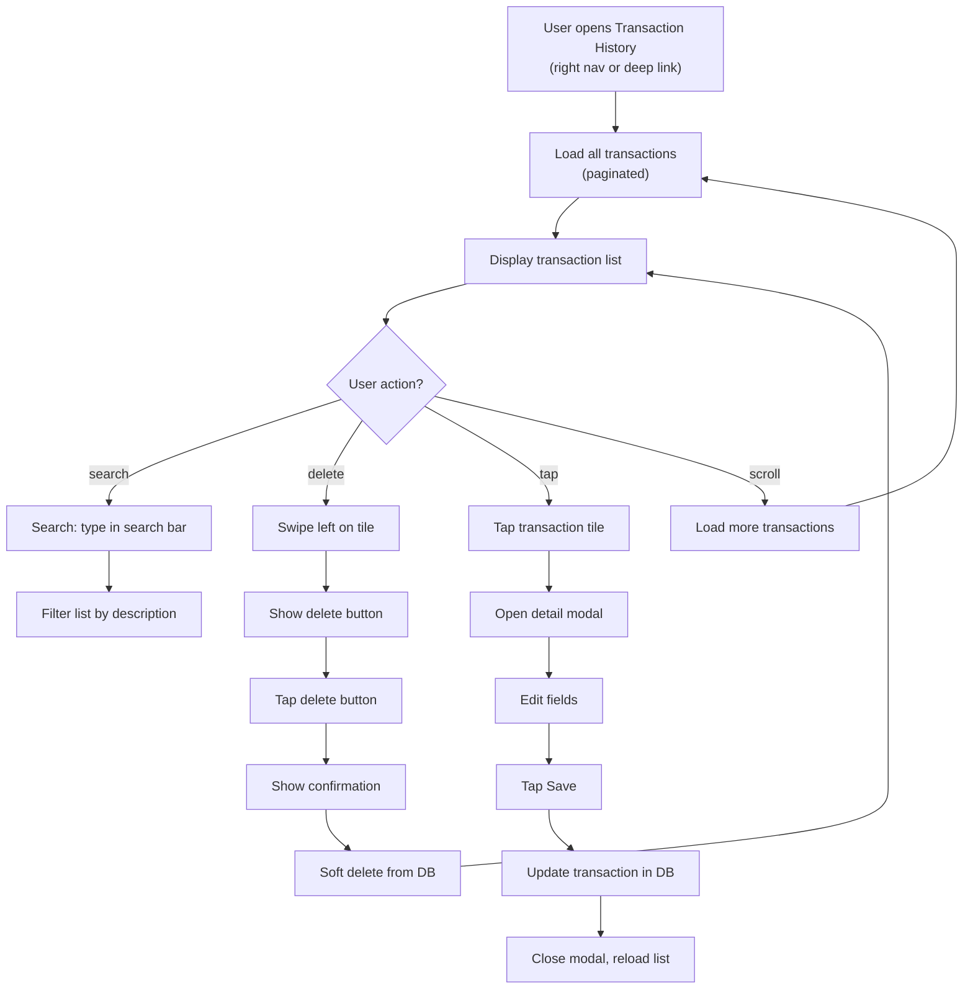

# Feature 05: Transaction History & Management

## Overview
Comprehensive view of all transactions (current month + historical). Users can view, search, and delete transactions. This is the detail view beyond the dashboard's quick summary.

## Scope

### Included in MVP
- Full transaction list (paginated, all transactions)
- Filter by month or date range
- Search by description/vendor
- View transaction detail (edit basic fields — optional)
- Delete transaction with confirmation (soft delete)
- Sort by date (newest/oldest)

### Not Included (v2+)
- Bulk edit (select multiple, change category)
- Transaction tagging / custom tags
- Duplicate detection and merge
- Transaction receipt attachment (image storage)
- Bulk delete with date range picker

## User Stories

### US-05.01: View All Transactions
**As a** a user  
**I want to** see a comprehensive list of all my transactions  
**So that** I can audit my spending in detail

**Acceptance Criteria**
- [ ] Transaction list displays all transactions (paginated, 20 per page)
- [ ] Each transaction shows:
  - Category icon + name (left, 48px icon)
  - Description (primary text)
  - Date (secondary text, e.g., "Jan 15, Tuesday")
  - Amount (right, bold, red for expenses / green for income)
  - Sync status dot (green=cloud, gray=local only)
- [ ] List sorted by date (newest first, configurable)
- [ ] "Load more" button at bottom to fetch next 20
- [ ] List is scrollable
- [ ] Pull-to-refresh reloads data

### US-05.02: Filter & Search Transactions
**As a** a user  
**I want to** search for specific transactions by description  
**So that** I can quickly find "that coffee I bought on Jan 15"

**Acceptance Criteria**
- [ ] Search bar at top of screen (magnifying glass icon)
- [ ] Typing filters list in real-time (debounced, 200ms)
- [ ] Search is case-insensitive, matches description or vendor name
- [ ] Clear button (X) clears search and shows all transactions
- [ ] If no matches, show: "No transactions found"
- [ ] Filter by date range (optional: date picker, can defer to v2)
- [ ] Filter by category (optional: checkbox list, can defer)

### US-05.03: Delete Transaction
**As a** a user  
**I want to** delete a transaction I logged by mistake  
**So that** I can fix errors

**Acceptance Criteria**
- [ ] Swipe left on transaction tile to reveal delete button (or hold-to-delete menu)
- [ ] Tapping delete shows confirmation: "Delete this transaction? You can't undo this."
- [ ] "Delete" button is red/prominent; "Cancel" is secondary
- [ ] On confirm, transaction marked as deleted (soft delete, set `deleted_at`)
- [ ] Transaction immediately removed from UI
- [ ] Undo option (optional): show toast "Deleted" with "Undo" button for 5 seconds
- [ ] Deleted transactions not queryable (excluded by `deleted_at IS NULL`)

### US-05.04: View Transaction Detail
**As a** a user  
**I want to** tap a transaction to see and edit its details  
**So that** I can correct parsing errors (wrong category, amount)

**Acceptance Criteria**
- [ ] Tapping transaction tile opens detail modal/sheet
- [ ] Modal shows:
  - Category (with dropdown to change)
  - Amount (editable text field)
  - Description (editable, raw input)
  - Date (editable date picker)
  - Vendor name (editable, optional)
  - Sync status (read-only)
- [ ] "Save" button updates transaction in database
- [ ] "Cancel" button closes without saving
- [ ] "Delete" button at bottom (alternative to swipe)
- [ ] Validation: amount must be > 0
- [ ] On successful save, return to list and show updated transaction

### US-05.05: Transaction Sync Status
**As a** a user with cloud sync enabled  
**I want to** see which transactions are backed up to the cloud  
**So that** I know my data is safe

**Acceptance Criteria**
- [ ] Small dot indicator on transaction tile:
  - Green = synced to cloud
  - Gray = local only (not backed up yet)
  - (Sync feature is v2, but status indicator should exist)
- [ ] Tooltip on hover (optional): "Synced" or "Local only"
- [ ] Icon is subtle, 8px, positioned bottom-right of category icon

## User Flow Diagram



## Database Operations

### Load all transactions (paginated)
```sql
SELECT 
  t.transaction_id,
  t.category_id,
  c.category_name,
  c.icon_name,
  t.description,
  t.amount_idr,
  t.transaction_type,
  t.transaction_date,
  t.is_synced_to_cloud,
  t.vendor_name
FROM transactions t
JOIN categories c ON t.category_id = c.category_id
WHERE t.user_id = ? AND t.deleted_at IS NULL
ORDER BY t.transaction_date DESC
LIMIT 20 OFFSET ?;
```

### Search transactions
```sql
SELECT 
  t.transaction_id,
  t.category_id,
  c.category_name,
  c.icon_name,
  t.description,
  t.amount_idr,
  t.transaction_type,
  t.transaction_date,
  t.is_synced_to_cloud
FROM transactions t
JOIN categories c ON t.category_id = c.category_id
WHERE t.user_id = ? 
  AND t.deleted_at IS NULL
  AND (LOWER(t.description) LIKE ? OR LOWER(t.vendor_name) LIKE ?)
ORDER BY t.transaction_date DESC;
```

### Soft delete
```sql
UPDATE transactions SET deleted_at = ?, updated_at = ? WHERE transaction_id = ? AND user_id = ?;
```

### Update transaction
```sql
UPDATE transactions 
SET category_id = ?, amount_idr = ?, description = ?, vendor_name = ?, transaction_date = ?, updated_at = ?
WHERE transaction_id = ? AND user_id = ? AND deleted_at IS NULL;
```

## Data Models

### Transaction Detail (from list/edit)
```dart
class TransactionDetail {
  final int transactionId;
  final int categoryId;
  final String categoryName;
  final String description;
  final int amountIdr;
  final String transactionType;  // 'expense' or 'income'
  final DateTime transactionDate;
  final String? vendorName;
  final bool isSyncedToCloud;
  final DateTime createdAt;
  final DateTime updatedAt;
  
  const TransactionDetail({
    required this.transactionId,
    required this.categoryId,
    required this.categoryName,
    required this.description,
    required this.amountIdr,
    required this.transactionType,
    required this.transactionDate,
    this.vendorName,
    required this.isSyncedToCloud,
    required this.createdAt,
    required this.updatedAt,
  });
}
```

### Edit Transaction Form State
```dart
class EditTransactionState {
  final int categoryId;
  final int amountIdr;
  final String description;
  final String? vendorName;
  final DateTime transactionDate;
  final Map<String, String> validationErrors;  // Field → error message
  
  const EditTransactionState({
    required this.categoryId,
    required this.amountIdr,
    required this.description,
    this.vendorName,
    required this.transactionDate,
    this.validationErrors = const {},
  });
}
```

## Edge Cases & Error Handling

| Edge Case | Behavior |
|-----------|----------|
| Delete undo timeout (> 5 seconds) | Undo button disappears; transaction permanently deleted |
| Category for transaction no longer exists (deleted) | Show category name from transaction record (not linked) |
| Amount exceeds max int (> 2.14B IDR) | Accept but warn: "Very large amount. Double-check?" |
| User edits amount to 0 | Validation error: "Amount must be positive" (prevent save) |
| Search returns 0 results | Show empty state: "No transactions found. Try another search?" |
| Database query timeout | Show error: "Loading took too long. Retry?" |
| Pagination: load next page while scrolling | Debounce to prevent multiple requests |
| Edit modal: user navigates away without saving | Discard changes (warn if > 1 change pending) |
| Delete cancelled: transaction still in list | No change; transaction unaffected |
| Offline edit: save without internet | Queue update locally; sync on reconnect (v2) |

## Implementation Notes

### Search Implementation
Use `debounce` to prevent query spam. On every keystroke:
1. Debounce 200ms
2. Build query with LIKE (case-insensitive)
3. Update provider state with search results
4. Re-render list

### Pagination
Implement "load more" pattern (not infinite scroll for UX simplicity):
- Load first 20 by default
- "Load more" button at bottom
- Clicking fetches next 20 and appends

### Undo Feature (Optional)
If implementing undo:
1. On delete, show toast: "Deleted" with "Undo" button
2. Toast disappears after 5s or user swipes it away
3. On undo, revert soft delete (set `deleted_at = NULL`)
4. Update UI immediately

### Swipe-to-Delete
Use Flutter `Dismissible` widget:
- Swipe left to reveal red delete button
- Background color: red (`--color-accent-danger`)
- Confirm with dialog before actually deleting

### Real-time Updates
When user edits transaction, broadcast change to dashboard (invalidate Riverpod provider so dashboard refreshes).

## Testing Strategy

### Unit Tests
- Search query builder (LIKE behavior)
- Amount validation (> 0)
- Pagination offset calculation
- Soft delete query (sets deleted_at)
- Date formatting

### Widget Tests
- Transaction list renders correctly
- Search bar appears and filters work
- Delete button appears on swipe
- Confirmation dialog shows
- Transaction detail modal opens/closes
- Edit fields validate (amount > 0)

### Integration Tests
- Full flow: load transactions → search → find result → edit → save → verify update
- Delete flow: swipe → confirm → transaction disappears → undo works
- Pagination: load 20 → scroll → load more → total > 40
- Offline behavior: edit → save locally → transaction persists

### Manual Testing
- Test with 0 transactions (empty state)
- Test with 1000+ transactions (pagination performance)
- Test search (partial matches, case-insensitive)
- Test delete with undo
- Test edit modal validation (reject 0 amount)
- Verify sync status dot appears correctly

## Definition of Done
- [ ] All user story acceptance criteria pass
- [ ] Transaction list displays paginated results (20 per page)
- [ ] Search works in real-time (debounced)
- [ ] Soft delete removes transaction from UI and database
- [ ] Edit modal validates amount > 0
- [ ] Undo works if implemented (5-second timeout)
- [ ] Sync status indicator displays correctly
- [ ] Database queries are efficient (no N+1 problems)
- [ ] No Dart compile errors (`flutter analyze` passes)
- [ ] Pagination doesn't cause duplicate entries
- [ ] Empty states display correctly (no results, no transactions)
- [ ] `docs/04_dev_log.md` updated with swipe library choice, etc.
- [ ] Status in `docs/00_master_plan.md` updated to ✅ Done

