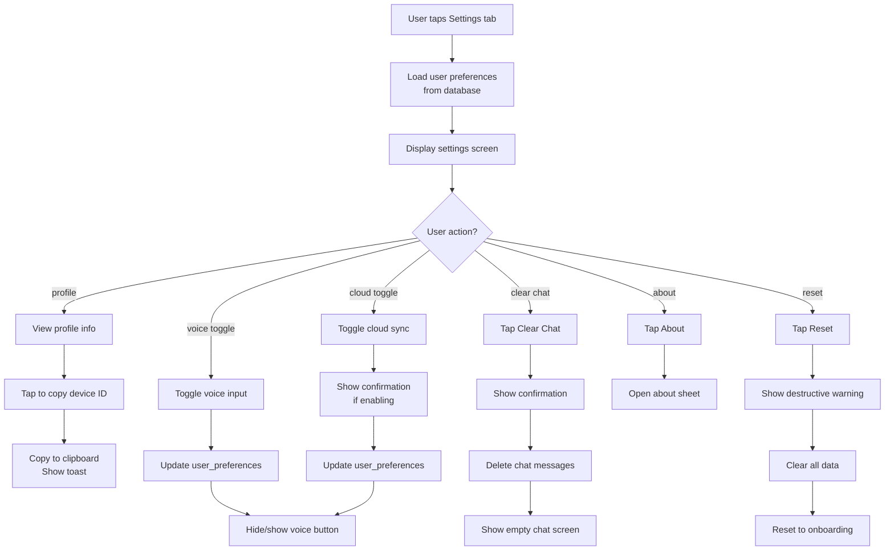

# Feature 06: Profile & Settings

## Overview
Settings screen (right tab in bottom navigation) where users configure app preferences, view their profile info, and manage advanced features like cloud backup and authentication. Minimal for MVP, focused on essential options.

## Scope

### Included in MVP
- Display user info (device ID, app version)
- Toggle voice input enable/disable
- Toggle cloud sync feature (flag only, actual sync is v2)
- View app version & build number
- Contact/feedback (optional: link to email)
- About Pawcket (Mr. Oyen story, app description)
- Clear chat history button
- Logout / sign out (local auth only, so minimal)

### Not Included (v2+)
- Biometric setup (face/fingerprint unlock)
- PIN setup / password change
- Account linking or multi-device sync
- Data export (CSV, JSON)
- Privacy policy / terms (can be web links)
- Theme customization (dark mode, colors)
- Language settings (Indonesian only for MVP)

## User Stories

### US-06.01: View Profile Info
**As a** a user  
**I want to** see my profile information  
**So that** I know what device this app is tied to

**Acceptance Criteria**
- [ ] Settings screen displays section: "Profile"
- [ ] Shows:
  - Device ID (masked last 8 chars, e.g., "Device: xxxxx1a2b")
  - App version (e.g., "Version: 1.0.0")
  - Build number (e.g., "Build: 42")
  - Created date (e.g., "Account created: Jan 15, 2025")
- [ ] Device ID is tappable to copy to clipboard (show "Copied!" toast)
- [ ] Info is read-only

### US-06.02: Toggle Voice Input
**As a** a user concerned about privacy  
**I want to** disable voice input if I don't need it  
**So that** the app doesn't record my microphone

**Acceptance Criteria**
- [ ] Settings has toggle: "Enable Voice Input"
- [ ] Toggle defaults to ON
- [ ] When OFF, voice button hidden in widget and chat
- [ ] When ON, voice button visible and functional
- [ ] Toggle state persisted to `user_preferences.enable_voice_input`
- [ ] Change takes effect immediately (no app restart needed)

### US-06.03: Cloud Sync Toggle
**As a** a user  
**I want to** enable optional cloud backup  
**So that** my data is safe if I lose my phone

**Acceptance Criteria**
- [ ] Settings has toggle: "Cloud Backup (Beta)"
- [ ] Toggle defaults to OFF (local-first privacy)
- [ ] Tapping toggle shows warning:
  - "Cloud backup will sync your transactions to a secure server."
  - "You can disable this anytime."
  - "Continue?" (confirm/cancel)
- [ ] If enabled, shows:
  - Sync status: "Last synced: [time]" or "Never"
  - Manual sync button: "Sync Now"
  - Sync frequency option (optional: "Auto every hour", "Manual only")
- [ ] If disabled, data stays local only
- [ ] Toggle state persisted to `user_preferences.enable_cloud_sync`
- [ ] No actual sync happens in MVP (v2 feature; just toggle)

### US-06.04: Clear Chat History
**As a** a user  
**I want to** delete all my chat messages with Mr. Oyen  
**So that** I can start fresh

**Acceptance Criteria**
- [ ] Settings has button: "Clear Chat History"
- [ ] Tapping shows confirmation: "Delete all chat messages? This can't be undone."
- [ ] "Delete" button is red; "Cancel" is secondary
- [ ] On confirm, all messages in `chat_messages` table are deleted (soft delete or hard delete)
- [ ] Old chat sessions are not deleted (just messages)
- [ ] User sees new empty chat screen after clearing
- [ ] Toast confirms: "Chat history cleared"

### US-06.05: About & Help
**As a** a curious user  
**I want to** learn more about Pawcket and Mr. Oyen  
**So that** I understand the app's story

**Acceptance Criteria**
- [ ] Settings has link: "About Pawcket"
- [ ] Tapping opens bottom sheet with:
  - Mr. Oyen 3D asset (large, happy expression)
  - Title: "Meet Mr. Oyen"
  - Description: "Your lazy financial buddy who gets bossy when you overspend"
  - App version, company/author (e.g., "Made with ❤️ for Gen Z")
  - Social links (optional: GitHub, Twitter, Discord)
  - "Got feedback?" link (mailto: support email)
- [ ] About sheet is dismissible (tap outside or swipe down)

### US-06.06: Logout / Reset App
**As a** a user  
**I want to** reset the app or start over  
**So that** I can test with a clean slate or hand off device to someone else

**Acceptance Criteria**
- [ ] Settings has button (advanced): "Reset App Data"
- [ ] Button is red/destructive appearance
- [ ] Tapping shows warning: "Delete all data? This can't be undone."
- [ ] Confirmation shows: "All transactions, categories, and settings will be deleted."
- [ ] "Delete Everything" button confirms (red)
- [ ] On confirm:
  - All tables cleared (transactions, categories, chat_messages, etc.)
  - User record reset (onboarding flag = 0)
  - App navigates to onboarding screen
  - New device ID generated on next launch

## User Flow Diagram



## Database Operations

### Load user preferences
```sql
SELECT * FROM user_preferences WHERE user_id = ?;
```

### Update voice input toggle
```sql
UPDATE user_preferences SET enable_voice_input = ?, updated_at = ? WHERE user_id = ?;
```

### Update cloud sync toggle
```sql
UPDATE user_preferences SET enable_cloud_sync = ?, updated_at = ? WHERE user_id = ?;
```

### Clear chat history (soft delete messages)
```sql
DELETE FROM chat_messages WHERE session_id IN (SELECT session_id FROM chat_sessions WHERE user_id = ?);
```

### Reset all app data (nuclear option)
```sql
-- Delete all user data
DELETE FROM transactions WHERE user_id = ?;
DELETE FROM categories WHERE user_id = ? AND is_default = 0;  -- Keep defaults
DELETE FROM chat_messages WHERE session_id IN (SELECT session_id FROM chat_sessions WHERE user_id = ?);
DELETE FROM chat_sessions WHERE user_id = ?;
DELETE FROM budgets WHERE user_id = ?;
DELETE FROM user_preferences WHERE user_id = ?;
UPDATE users SET has_completed_onboarding = 0, updated_at = ? WHERE user_id = ?;
```

## Data Models

### User Preferences (Local)
```dart
class UserPreferences {
  final int preferenceId;
  final int userId;
  final bool enableVoiceInput;
  final bool enableCloudSync;
  final bool enableNotifications;
  final String themeMode;  // 'light', 'dark', 'auto'
  final bool requirePinUnlock;
  final bool requireBiometric;
  final DateTime createdAt;
  final DateTime updatedAt;
  
  const UserPreferences({
    required this.preferenceId,
    required this.userId,
    required this.enableVoiceInput,
    required this.enableCloudSync,
    required this.enableNotifications,
    this.themeMode = 'light',
    this.requirePinUnlock = false,
    this.requireBiometric = false,
    required this.createdAt,
    required this.updatedAt,
  });
}

class ProfileInfo {
  final String deviceId;
  final String appVersion;
  final int buildNumber;
  final DateTime createdDate;
  
  const ProfileInfo({
    required this.deviceId,
    required this.appVersion,
    required this.buildNumber,
    required this.createdDate,
  });
}
```

## Edge Cases & Error Handling

| Edge Case | Behavior |
|-----------|----------|
| User enables cloud sync but has no internet | Toggle enabled but sync fails → show "No internet" message on manual sync |
| Copy device ID on no-clipboard device | Show: "Device ID: [full_id]" instead of copy (fallback) |
| User opens settings while chat is updating | Preferences load independently; no conflict |
| Reset app data while transaction syncing | Stop sync; clear everything; reset to onboarding |
| Database error during preferences update | Show error: "Failed to save setting. Try again?" |
| Preferences corrupted (NULL values) | Use hardcoded defaults (voice on, cloud off, light theme) |
| User taps reset multiple times | Debounce confirmation (ignore rapid taps after first) |

## Implementation Notes

### Version & Build Info
Get from `pubspec.yaml` + gradle (Android) / Info.plist (iOS):
- `version` field for app version
- `buildNumber` field for build number
- Parse at runtime using `package_info_plus`

### Copy to Clipboard
Use `flutter/services.dart` `Clipboard.setData()`:
```dart
await Clipboard.setData(ClipboardData(text: deviceId));
ScaffoldMessenger.of(context).showSnackBar(SnackBar(content: Text("Copied!")));
```

### Settings State Management
Use Riverpod provider to expose user preferences globally:
```dart
final userPreferencesProvider = FutureProvider<UserPreferences>((ref) async {
  return await db.getUserPreferences();
});
```

### Reactive Updates
When user toggles a setting:
1. Update database
2. Invalidate Riverpod provider
3. Widgets listening to provider re-render (e.g., widget input layer reacts to voice toggle)

### Cloud Sync Warning
Include warning text in toggle UI:
```
"Cloud Backup (Beta)"
"Your transactions will be encrypted and stored securely. Learn more."
```
(Link to privacy policy — can be a web link)

## Testing Strategy

### Unit Tests
- Preferences CRUD (read, update)
- Device ID generation and masking
- Version parsing from pubspec
- Toggle state validation

### Widget Tests
- Settings screen renders all sections
- Toggles enable/disable correctly
- Copy device ID button works (check clipboard)
- Buttons are styled correctly (reset button is red)
- Profile info displays correctly

### Integration Tests
- Full flow: toggle voice input → voice button hidden in widget
- Toggle cloud sync → confirmation dialog shows
- Clear chat history → messages deleted, chat screen empty
- Reset app data → onboarding screen shown
- Preferences persist across app restarts

### Manual Testing
- Test with first-time user (no preferences created yet)
- Test toggle on/off (verify change takes effect immediately)
- Test copy device ID (paste it somewhere to verify)
- Test reset (verify all data gone, onboarding shown)
- Test cloud sync toggle (verify warning shown)

## Definition of Done
- [ ] All user story acceptance criteria pass
- [ ] Profile info displays device ID, version, build number
- [ ] Voice toggle hides/shows voice buttons in widget and chat
- [ ] Cloud sync toggle shows warning and saves preference
- [ ] Clear chat history deletes messages and shows confirmation
- [ ] About sheet displays Mr. Oyen asset and app description
- [ ] Reset app data clears all transactions, chat, settings
- [ ] Settings persist across app restarts
- [ ] Copy device ID works (check clipboard)
- [ ] Buttons have correct styling (destructive buttons are red)
- [ ] No Dart compile errors (`flutter analyze` passes)
- [ ] No database errors during preference updates
- [ ] `docs/04_dev_log.md` updated with any decisions
- [ ] Status in `docs/00_master_plan.md` updated to ✅ Done

