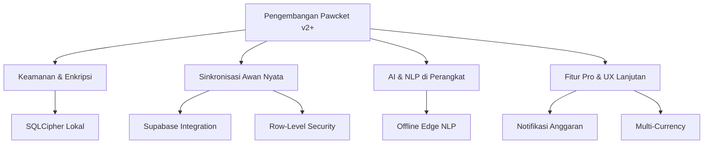

# Pawcket — Rekomendasi Pengembangan Masa Depan (v2+)

Dokumen ini memuat rencana jangka menengah dan panjang (v2+) untuk mengembangkan Pawcket dari aplikasi berstatus MVP (Minimum Viable Product) menjadi aplikasi keuangan yang aman, siap produksi, dan siap rilis di toko aplikasi resmi (App Store & Google Play Store).

---

## 📌 Pilar Pengembangan Utama



---

## 1. Keamanan & Enkripsi Data Lokal (Privacy-First)
Sebagai aplikasi keuangan pribadi dengan visi privasi tinggi, data lokal pengguna di SQLite harus terlindungi dari pencurian fisik perangkat.

* **Rekomendasi Teknis**: Mengintegrasikan **SQLCipher** menggunakan paket `sqflite_sqlcipher` untuk mengenkripsi berkas database `.db` secara lokal.
* **Mekanisme Kunci**: Kunci enkripsi dapat diturunkan dari PIN aplikasi pengguna menggunakan metode enkripsi PBKDF2 atau disimpan di *hardware-backed storage* perangkat menggunakan `flutter_secure_storage`.
* **Kriteria Keberhasilan**: Database tidak dapat dibaca atau diekstrak saat perangkat di-*root* atau didekripsi secara ilegal.

---

## 2. Sinkronisasi Awan & Autentikasi Nyata (Supabase)
Mengubah status simulasi sinkronisasi (Feature 07 MVP Stub) menjadi sistem sinkronisasi dinamis yang terhubung ke server cloud.

* **Penyedia Layanan**: **Supabase** (PostgreSQL + Auth + Realtime).
* **Alur Autentikasi**: 
  - Mendukung login sederhana via Email + Password.
  - Mendukung OAuth (Google / Apple Sign-In) untuk kemudahan pendaftaran.
* **Keamanan Data**: Mengaktifkan Row-Level Security (RLS) di PostgreSQL Supabase agar pengguna hanya bisa membaca/menulis baris data mereka sendiri berdasarkan token JWT dari `auth.uid()`.

### Rekomendasi DDL Database Supabase (Awan)
```sql
-- Mengaktifkan ekstensi UUID generator jika belum ada
CREATE EXTENSION IF NOT EXISTS "uuid-ossp";

-- 1. Tabel Profil Pengguna Cloud (Sinkronisasi otomatis dengan auth.users Supabase)
CREATE TABLE public.cloud_profiles (
  profile_id UUID PRIMARY KEY REFERENCES auth.users(id) ON DELETE CASCADE,
  display_name TEXT,
  updated_at TIMESTAMP WITH TIME ZONE DEFAULT timezone('utc'::text, now()) NOT NULL
);

-- 2. Tabel Transaksi Cloud yang Terenkripsi
CREATE TABLE public.cloud_transactions (
  transaction_id UUID PRIMARY KEY DEFAULT gen_random_uuid(),
  user_id UUID NOT NULL REFERENCES public.cloud_profiles(profile_id) ON DELETE CASCADE,
  local_id INTEGER NOT NULL, -- ID Transaksi di database lokal SQLite
  category_name TEXT NOT NULL,
  amount_idr INTEGER NOT NULL,
  description TEXT,
  payment_method TEXT,
  transaction_date TIMESTAMP WITH TIME ZONE NOT NULL,
  created_at TIMESTAMP WITH TIME ZONE DEFAULT timezone('utc'::text, now()) NOT NULL,
  updated_at TIMESTAMP WITH TIME ZONE DEFAULT timezone('utc'::text, now()) NOT NULL,
  deleted_at TIMESTAMP WITH TIME ZONE,
  CONSTRAINT cloud_transactions_amount CHECK (amount_idr > 0)
);

-- 3. Kebijakan Keamanan RLS (Row-Level Security)
ALTER TABLE public.cloud_transactions ENABLE ROW LEVEL SECURITY;

CREATE POLICY "Pengguna hanya dapat melihat data pribadi" ON public.cloud_transactions
  FOR SELECT USING (auth.uid() = user_id);

CREATE POLICY "Pengguna hanya dapat menyisipkan data pribadi" ON public.cloud_transactions
  FOR INSERT WITH CHECK (auth.uid() = user_id);

CREATE POLICY "Pengguna hanya dapat mengubah data pribadi" ON public.cloud_transactions
  FOR UPDATE USING (auth.uid() = user_id) WITH CHECK (auth.uid() = user_id);

CREATE POLICY "Pengguna hanya dapat menghapus data pribadi" ON public.cloud_transactions
  FOR DELETE USING (auth.uid() = user_id);
```

---

## 3. AI & NLP di Perangkat (Off-Grid Capabilities)
Pencatatan berbasis NLP pada versi MVP saat ini masih bergantung pada koneksi internet untuk memanggil API OpenRouter/Gemini.

* **Rekomendasi Teknis**: Mengintegrasikan model pemrosesan bahasa alami berukuran mini langsung di dalam aplikasi (misal menggunakan TensorFlow Lite, MediaPipe, atau model regex terstruktur yang dioptimalkan).
* **Mekanisme Transisi**: 
  - Jika perangkat **online**, kirim teks ke LLM OpenRouter untuk hasil analisis semantik yang kaya.
  - Jika perangkat **offline**, gunakan mesin NLP lokal (Edge AI) untuk mengekstrak kategori, jumlah uang, dan deskripsi secara instan.
* **Kelebihan**: Menghemat biaya token API, meningkatkan kecepatan respons (< 100ms), dan menjaga privasi data karena pemrosesan tidak keluar dari perangkat.

---

## 4. Fitur Pro & Peningkatan Pengalaman Pengguna (UX)

### A. Pengingat & Notifikasi Anggaran Bulanan
* **Detail**: Menggunakan paket `flutter_local_notifications` untuk mendeteksi pengeluaran bulanan pengguna di latar belakang.
* **Logika**: Jika total pengeluaran pada kategori tertentu mencapai **80%** dari limit anggaran yang ditentukan di tabel `budgets`, kirim notifikasi dorong (*push notification*) yang ditulis dengan gaya bahasa Mr. Oyen yang khas (misalnya: *"Oi! Anggaran jajanmu sudah kritis! Berhenti jajan sebelum dompet kita menangis!"*).

### B. Dukungan Multi-Mata Uang (Multi-Currency)
* **Detail**: Memungkinkan pencatatan transaksi menggunakan mata uang asing (USD, JPY, EUR, SGD) dan menyimpannya ke database dengan kurs konversi ke IDR secara otomatis.
* **Penyimpanan**: Menambahkan tabel `exchange_rates` di SQLite lokal yang memperbarui data kurs harian secara latar belakang ketika perangkat mendeteksi koneksi internet.

### C. Ekspor Laporan Keuangan (CSV & PDF)
* **Detail**: Memungkinkan pengguna untuk mengekspor seluruh riwayat transaksi mereka ke dalam format lembar kerja `.csv` atau dokumen laporan visual `.pdf` untuk keperluan pelaporan pajak atau pencatatan pribadi.

---

## 5. Rencana Migrasi & Kompatibilitas Versi
Sebelum merilis pembaruan v2+, pastikan proses migrasi data lokal pengguna berjalan mulus tanpa menghapus transaksi yang sudah ada:

| Tahapan Migrasi | Detail Aksi | Mitigasi Risiko |
| :--- | :--- | :--- |
| **Migrasi Schema SQLite** | Menambahkan kolom `sync_version` pada database lokal untuk mendeteksi konflik sinkronisasi. | Menggunakan fitur peningkatan versi SQLite (`onUpgrade` di SQLite helper) untuk menjaga integritas data tanpa *data-wipe*. |
| **Inisialisasi Keamanan PIN** | Mewajibkan pengguna membuat PIN saat pertama kali memperbarui aplikasi ke versi v2+. | Memberikan tutorial singkat mengenai enkripsi database lokal agar pengguna paham pentingnya PIN tersebut. |
| **Sinkronisasi Pertama (First Sync)** | Mengunggah seluruh transaksi lokal lama yang belum pernah disinkronkan ke Supabase setelah pengguna sukses login pertama kali. | Melakukan sinkronisasi secara parsial (batching per 50 transaksi) agar tidak melebihi kuota beban server cloud. |
