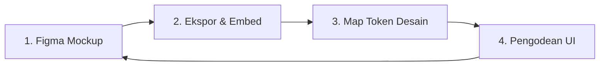

# Pawcket — Panduan Alur Kerja Desain & Integrasi UI/UX (v2+)

Dokumen ini berisi pedoman alur kerja (*design workflow*) untuk melakukan iterasi visual dan merancang antarmuka pengguna (UI/UX) pada pengembangan Pawcket selanjutnya. Dokumen ini bertujuan untuk memastikan setiap fitur baru memiliki visual premium yang konsisten, berstandar industri, dan mudah diimplementasikan oleh pengembang (baik manusia maupun AI).

---

## 🔄 Siklus Alur Kerja Desain (Figma-First)

Untuk menghindari desain UI yang terasa "tambal sulam" di akhir proyek, tim pengembang wajib mengikuti siklus 4 langkah berikut sebelum menulis baris kode UI pertama:



### Langkah 1: Pembuatan Mockup di Figma/Sketch (Upfront Design)
* **Aturan**: Seluruh tata letak layar, animasi, tombol, dan pop-up harus dirancang terlebih dahulu di Figma.
* **Tujuan**: Memisahkan pemikiran logis pemrograman dengan estetika visual. Pengembang fokus menyelaraskan *user flow* dan kontras warna terlebih dahulu di alat desain.

### Langkah 2: Ekspor Aset & Sematkan Gambar ke Dokumen Fitur
* **Aturan**: Ekspor hasil desain halaman menjadi berkas gambar (PNG/JPG) dan simpan ke folder `docs/assets/mockups/`.
* **Implementasi**: Sematkan gambar tersebut di dalam dokumen spesifikasi fitur terkait pada sub-folder `docs/03_features/` untuk dijadikan acuan visual mutlak bagi AI Agent.

### Langkah 3: Pemetaan Token Desain (*Design Tokens Mapping*)
* **Aturan**: Definisikan warna dasar (Hex/HSL), ukuran teks, dan jarak padding yang digunakan pada halaman tersebut dan cocokkan dengan token yang ada di `lib/config/theme.dart`.
* **Tujuan**: Mencegah penulisan kode angka/warna mentah (*hardcoded values*) di dalam widget aplikasi.

### Langkah 4: Pengodean UI Menggunakan Tema Global
* **Aturan**: AI atau developer mulai menulis kode UI dengan mereferensikan gambar mockup dan menggunakan parameter dari `AppTheme`.

---

## 🎨 Pedoman Token Desain Pawcket

Semua kode antarmuka di aplikasi Pawcket wajib mengikuti aturan token global yang didefinisikan pada `lib/config/theme.dart`. Berikut adalah pedoman penggunaannya:

### 1. Sistem Warna (Color System)
Gunakan palet warna terkurasi untuk memberikan kesan modern, bersih, dan premium (hindari warna dasar murni seperti merah menyala `#FF0000` atau biru murni `#0000FF`).

* **Primary (Indigo)**: Digunakan untuk elemen utama seperti tombol aksi primer, tab aktif, dan penanda fokus.
  - Token: `AppColors.primary` (#6366F1)
* **Secondary (Cyan)**: Digunakan untuk elemen informasi sekunder dan aksen visual.
  - Token: `AppColors.secondary` (#0EA5E9)
* **Neutrals (Gray Scale)**: Digunakan untuk teks, latar belakang, pembatas (*divider*), dan bayangan kartu.
  - Latar Belakang Aplikasi: `AppColors.neutral50` (#F9FAFB)
  - Latar Belakang Kartu: `AppColors.neutral0` (#FFFFFF)
  - Teks Utama / Judul: `AppColors.neutral900` (#111827)
  - Teks Pembantu / Deskripsi: `AppColors.neutral500` (#6B7280)
* **Semantic Colors**:
  - Sukses (Pemasukan / Selesai): `AppColors.success` (#10B981)
  - Bahaya (Hapus / Danger Zone): `AppColors.danger` (#EF4444)
  - Peringatan (Limit Anggaran): `AppColors.warning` (#F59E0B)

### 2. Spasi & Padding (Spacing System)
Hindari penggunaan angka acak untuk jarak margin, padding, atau tinggi kolom. Gunakan token dari kelas `AppSpacing`:

| Spasi Token | Nilai Piksel | Kegunaan Umum |
| :--- | :--- | :--- |
| `AppSpacing.space1` | 4.0 | Jarak teks judul dengan sub-judul kecil |
| `AppSpacing.space2` | 8.0 | Jarak antar elemen di dalam kartu / list item |
| `AppSpacing.space3` | 12.0 | Padding bagian dalam kartu kecil |
| `AppSpacing.space4` | 16.0 | Padding default halaman (kiri dan kanan) |
| `AppSpacing.space6` | 24.0 | Jarak antar seksi/card besar di halaman |
| `AppSpacing.space8` | 32.0 | Jarak aman tombol aksi di bagian bawah layar |

### 3. Bentuk & Sudut Elemen (Radius)
Aplikasi Pawcket mengadopsi gaya visual yang ramah dan dinamis (Gen Z aesthetic), yang ditandai dengan sudut melengkung yang halus:
* **Kartu (Cards)**: Radius sudut wajib diatur sebesar **12px** (`BorderRadius.circular(12)`).
* **Kolom Input (Text Fields)**: Radius sudut sebesar **8px** (`BorderRadius.circular(8)`).
* **Tombol Utama (Buttons)**: Radius sudut sebesar **8px** (`BorderRadius.circular(8)`).

---

## 📥 Struktur Direktori Aset Desain

Semua berkas terkait desain antarmuka pengguna harus disimpan dengan rapi di folder berikut agar mudah dilacak:

```directory
c:\Users\fakhr\flutter projects\pawcket-prd\
└── docs\
    └── assets\
        ├── mockups\       # Screenshot desain halaman Figma per fitur (PNG/JPG)
        ├── vectors\       # Ikon kustom, aset ilustrasiSVG
        └── mascot\        # Ekspresi Mr. Oyen terbaru dalam resolusi tinggi
```

---

## Checklist Evaluasi UI/UX (Definition of Done)

Sebelum kode UI dinyatakan selesai dan dapat dimerge ke cabang utama (*main branch*), lakukan verifikasi terhadap checklist berikut:

- [ ] Apakah seluruh warna yang digunakan merujuk pada `AppColors`? (Tidak boleh ada `Color(0xFF...)` di dalam kode widget biasa).
- [ ] Apakah seluruh ukuran dan gaya teks merujuk pada `Theme.of(context).textTheme`? (Tidak boleh ada deklarasi `fontSize` manual di widget kecuali ada kebutuhan khusus yang terdokumentasi).
- [ ] Apakah jarak margin dan padding menggunakan kelipatan sistem spasi `AppSpacing`?
- [ ] Apakah tampilan layar sudah responsif pada berbagai ukuran layar (misalnya, diuji pada emulator layar kecil sekelas Nexus 4 hingga layar besar)?
- [ ] Apakah animasi transisi antar halaman terasa halus dan konsisten dengan panduan desain?
- [ ] Apakah berkas screenshot hasil implementasi UI di emulator sudah disimpan dan dibandingkan dengan berkas mockup di Figma?
